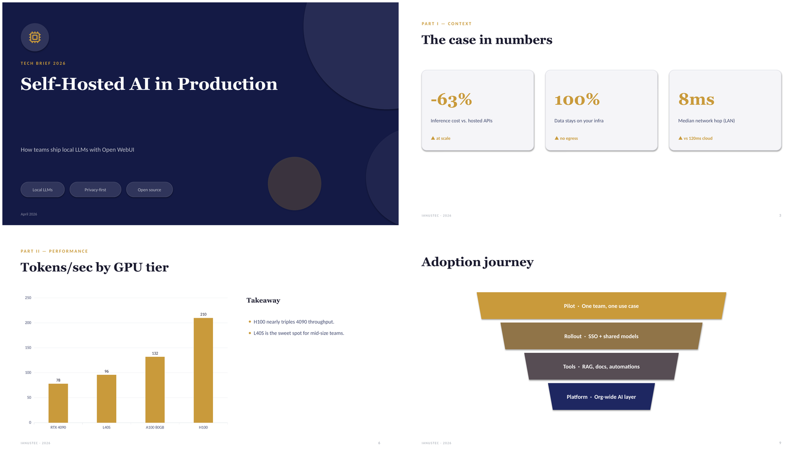
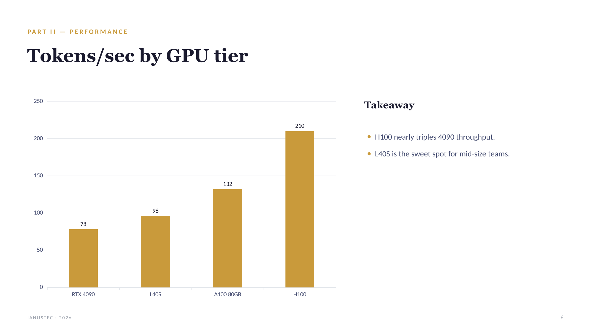
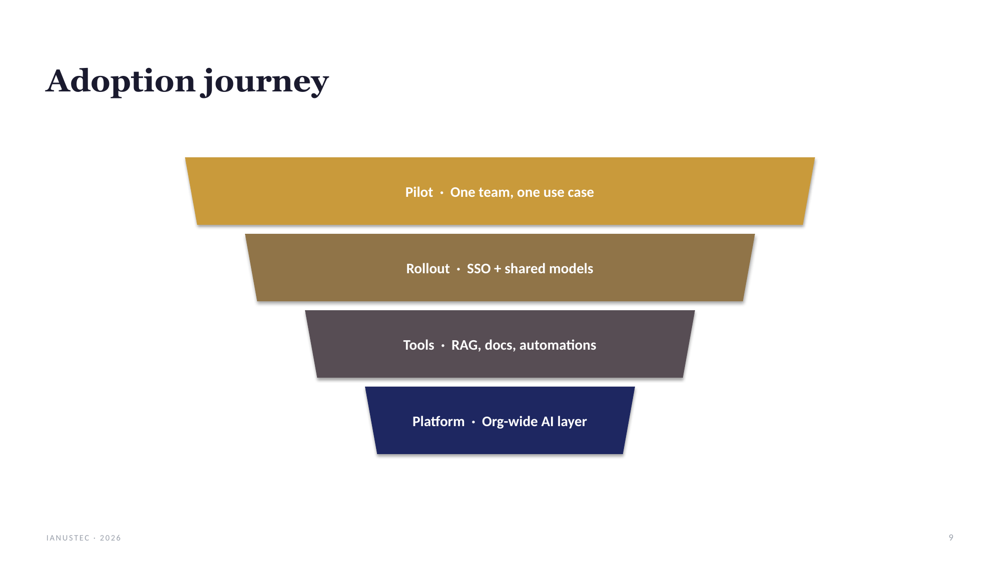

# Generate Slides — Native PPTX engine for Open WebUI

Un **Tool** per [Open WebUI](https://github.com/open-webui/open-webui) che genera
presentazioni **PowerPoint (.pptx) native** partendo da una specifica JSON prodotta
dal modello. Non esporta HTML né immagini: costruisce direttamente le slide con
`python-pptx`, con un sistema visivo coerente, forme decorative a layer, **grafici
nativi**, icone dentro cerchi e layout ricchi.

Il file risultante viene salvato tramite la **Files API** di Open WebUI (con
fallback su `/cache/files`) e nel messaggio compare un **link di download** cliccabile.

> Licenza: MIT · Autore: [IANUSTEC](https://ianustec.com)



*Slide generate dall'esempio [`examples/deck.json`](examples/deck.json) → [`examples/demo_tech_deck.pptx`](examples/demo_tech_deck.pptx).*

## Caratteristiche

- **.pptx nativo e modificabile** (testo, grafici e forme editabili in PowerPoint/Keynote/LibreOffice).
- **Grafici nativi Office**: `bar`, `line`, `area`, `pie`, `doughnut`, `radar`, `stacked_bar`.
- **~25 layout** pronti: copertina, sezioni, bullet, colonne/confronto, KPI, timeline,
  process flow, liste con icone, griglie di icone, pillars, quote, alert, tabelle,
  diagrammi (funnel, pyramid, cycle, quadrant, bullseye) e layout con immagini.
- **Temi curati** + accento personalizzabile (`theme:"auto"` deduce il tema dal contenuto).
- **Icone** in stile Lucide incluse nel file (nessuna dipendenza di rete per le icone).
- **Immagini opzionali** da Unsplash (con chiave) o generate via Open WebUI.
- **Single-file**: un solo `.py` autosufficiente, pronto da incollare nel registro Tools.

## Requisiti

- Open WebUI `>= 0.4.0`
- Python: `python-pptx`, `pillow` (dichiarati nel frontmatter → Open WebUI li installa in automatico)
- Opzionale: `httpx` (fetch immagini da URL/Unsplash)

## Installazione

### Opzione A — dalla community Open WebUI
1. Apri la pagina del tool sulla community di Open WebUI.
2. Clicca **Get** / **Import** verso la tua istanza.

### Opzione B — manuale
1. Nella tua istanza Open WebUI vai su **Workspace → Tools → +**.
2. Incolla il contenuto di [`generate_slides.py`](generate_slides.py).
3. Salva. Le dipendenze dichiarate nel frontmatter vengono installate al primo uso.
4. Abilita il tool per il modello (o per la chat) che deve usarlo.

## Uso

Il modello chiama la funzione `generate_slides(content)` dove `content` è **una
singola stringa JSON**. Struttura minima:

```json
{
  "title": "Titolo della presentazione",
  "subtitle": "Sottotitolo opzionale",
  "author": "Autore / studio",
  "theme": "auto",
  "footer": "Etichetta footer",
  "slides": [
    { "layout": "cover", "title": "...", "subtitle": "...", "icon": "cpu" },
    { "layout": "kpi_row", "title": "...", "stats": [ { "value": "-40%", "label": "..." } ] }
  ]
}
```

Vedi l'esempio completo in [`examples/deck.json`](examples/deck.json).

### Temi
`auto` (default, dedotto dal contenuto) · `midnight` · `forest` · `ocean` · `coral`
· `terracotta` · `teal` · `berry` · `sage` · `cherry` · `charcoal` · `slate`.
Puoi forzare l'accento con `"accent": "#C99A3B"`.

### Layout disponibili (campi principali)

| Layout | Campi principali |
|---|---|
| `cover` | `title`, `subtitle`, `author`, `eyebrow`, `icon`, `date`, `chips[]` |
| `section` | `number` (`"01"`), `eyebrow`, `title`, `lead` |
| `title_bullets` | `title`, `eyebrow`, `bullets[]` |
| `title_body` | `title`, `eyebrow`, `body` (paragrafi separati da `\n`) |
| `two_column_text` / `comparison_two` | `left{}`, `right{}` o `columns[]` (`heading`, `icon`, `points[]`, `highlight`, `badge`) |
| `kpi_row` | `stats[]` con `{value, label, change}` |
| `timeline_horizontal` / `process_flow` | `steps[]` con `{when, title, description}` |
| `icon_list_vertical` | `items[]` con `{icon, title, description}` |
| `icon_grid_2x2` / `icon_grid_3` / `pillars` | `items[]` con `{icon, title, description}` |
| `chart` | `chart_type`, `labels[]`, `values[]` o `datasets[]{label,data[]}`, `insight[]` |
| `funnel` / `pyramid` / `cycle` / `quadrant` / `bullseye` | `nodes[]` con `{label, description}` |
| `quote` | `quote`, `author`, `role` |
| `alert` | `title`, `level` (`info`\|`tip`\|`warning`\|`danger`), `body` o `bullets[]` |
| `table` | `headers[]`, `rows[]` |
| `text_image_right` / `image_left_text_right` | `title`, `bullets[]`/`body`, `image_hint` o `image_url` o `base64` |
| `image_full_caption` | `title`, `subtitle`, `image_hint`/`image_url` |
| `closing` | `title`, `eyebrow`, `takeaways[]`, `contact` |

## Screenshots

| Cover | KPI row |
|---|---|
|  |  |
| **Native chart** | **Funnel** |
|  |  |

## Valves (configurazione)

| Valve | Default | Descrizione |
|---|---|---|
| `default_theme` | `auto` | Tema di default se non indicato nella spec |
| `footer_label` | `""` | Footer di default (override via `spec.footer`) |
| `unsplash_access_key` | `""` | Chiave Unsplash per immagini stock (opzionale) |
| `image_generation` | `false` | Abilita generazione immagini AI via Open WebUI |
| `max_image_px` | `1600` | Larghezza massima immagini |
| `emit_status` | `true` | Emette eventi di stato in chat |
| `pptx_export_dir` | `/app/backend/data/cache/files` | Directory di fallback per il salvataggio |

## Come funziona

1. Il modello produce la spec JSON e chiama `generate_slides`.
2. L'engine risolve tema/accento, prefetch delle immagini (se presenti layout immagine),
   e per ogni slide invoca il renderer del layout corrispondente.
3. Le forme, i testi e i grafici vengono scritti come oggetti nativi OOXML.
4. Il `.pptx` viene salvato via Files API (fallback `/cache/files`) e il link torna in chat.

## Sviluppo / test locale

Serve `python-pptx` e (opzionale) `pillow`/`httpx`:

```bash
pip install python-pptx pillow httpx
python examples/build.py   # → examples/demo_tech_deck.pptx
```

Il file è pensato per girare dentro Open WebUI: gli import verso `open_webui.*` sono
opzionali e il tool degrada correttamente se assenti (utile per test isolati del rendering).

## Contribuire

Issue e PR benvenute. Mantieni il file **single-file** e senza dipendenze di rete
obbligatorie per le funzioni core.

## Licenza

[MIT](LICENSE) © IANUSTEC
