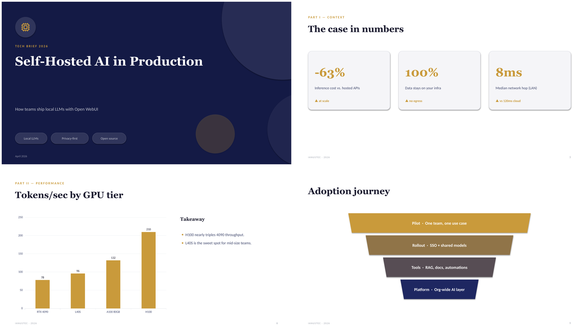
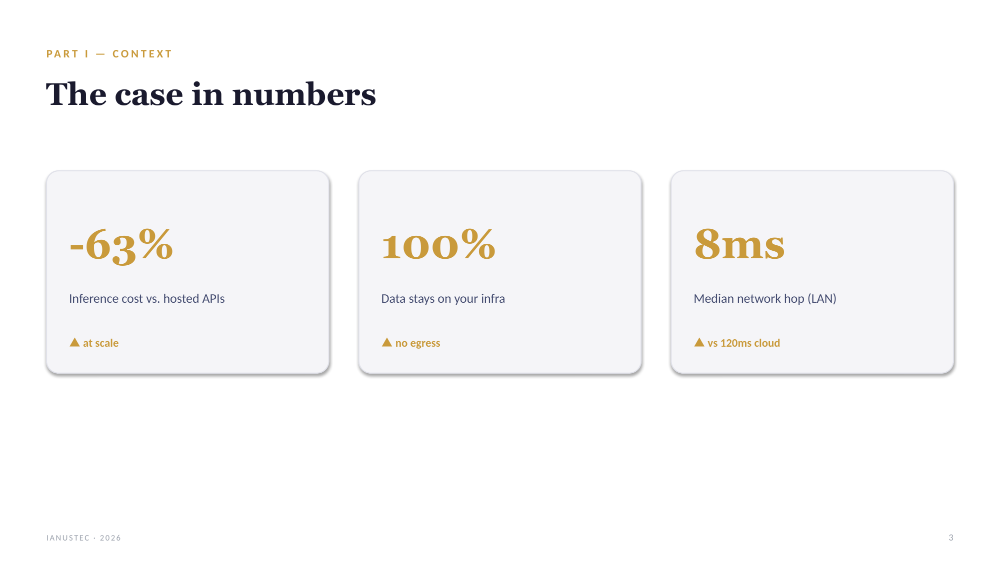
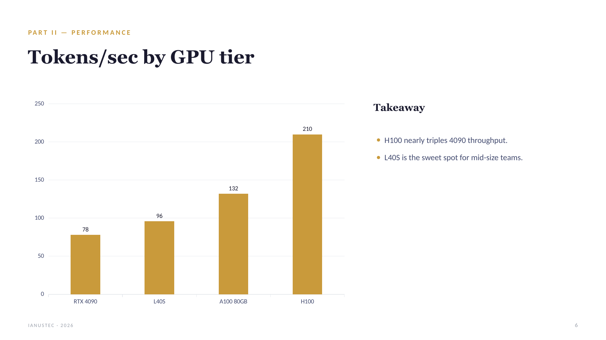
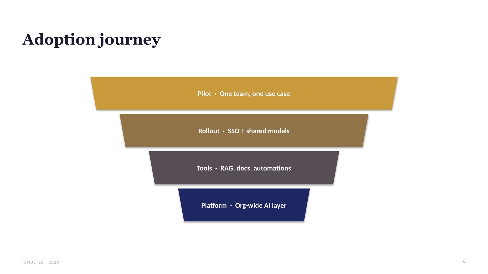

# Generate Slides — Native PPTX engine for Open WebUI

> Part of **[NEURA Office](https://github.com/ianustec/neura-office)**: native Word, PowerPoint and Excel for Open WebUI.

A [Open WebUI](https://github.com/open-webui/open-webui) **Tool** that generates
**native PowerPoint (.pptx)** presentations from a JSON spec produced by the model.
It doesn't export HTML or images: it builds the slides directly with `python-pptx`,
with a coherent visual system, layered decorative shapes, **native charts**, icons
inside circles and rich layouts.

The resulting file is saved through Open WebUI's **Files API** (with a `/cache/files`
fallback) and a clickable **download link** appears in the chat.

> License: MIT · Author: [IANUSTEC](https://ianustec.com)



*Slides generated from the example [`examples/deck.json`](examples/deck.json) → [`examples/demo_tech_deck.pptx`](examples/demo_tech_deck.pptx).*

## Features

- **Native, editable .pptx** (text, charts and shapes are editable in PowerPoint/Keynote/LibreOffice).
- **Native Office charts**: `bar`, `line`, `area`, `pie`, `doughnut`, `radar`, `stacked_bar`.
- **~25 ready-made layouts**: cover, sections, bullets, columns/comparison, KPIs, timeline,
  process flow, icon lists, icon grids, pillars, quote, alert, tables,
  diagrams (funnel, pyramid, cycle, quadrant, bullseye) and image layouts.
- **Curated themes** + custom accent (`theme:"auto"` infers the theme from the content).
- **Lucide-style icons** bundled in the file (no network dependency for icons).
- **Optional images** from Unsplash (with a key) or generated via Open WebUI.
- **Template Mode** (v1.1.0): build a deck by cloning shapes from a user `.pptx` template and overlaying content in the template safe zone.
- **`inspect_slides`**: JSON inventory of template shapes, safe zones, and optional embedded images (for `drop_ids` and mapping).
- **Single-file**: one self-contained `.py`, ready to paste into the Tools registry.

See [CHANGELOG.md](CHANGELOG.md) for release notes.

## Requirements

- Open WebUI `>= 0.4.0`
- Python: `python-pptx`, `pillow` (declared in the frontmatter → Open WebUI installs them automatically)
- Optional: `httpx` (fetch images from URL/Unsplash)

## Installation

### Option A — from the Open WebUI community
1. Open the tool page on the Open WebUI community site.
2. Click **Get** / **Import** to your instance.

### Option B — manual
1. In your Open WebUI instance go to **Workspace → Tools → +**.
2. Paste the contents of [`generate_slides.py`](generate_slides.py).
3. Save. The declared dependencies are installed on first use.
4. Enable the tool for the model (or chat) that should use it.

## Usage

The model calls `generate_slides(content)`, where `content` is a **single JSON string**.
Minimal structure:

```json
{
  "title": "Presentation title",
  "subtitle": "Optional subtitle",
  "author": "Author / company",
  "theme": "auto",
  "footer": "Footer label",
  "slides": [
    { "layout": "cover", "title": "...", "subtitle": "...", "icon": "cpu" },
    { "layout": "kpi_row", "title": "...", "stats": [ { "value": "-40%", "label": "..." } ] }
  ]
}
```

See the full example in [`examples/deck.json`](examples/deck.json).

### Classic customization (no template)

Works on the standard theme engine (no `reference_file_id` required):

| Field | Effect |
|---|---|
| `palette.primary`, `palette.dark`, `palette.accent`, `palette.light_accent` | Override named theme colors |
| `accent`, `primary` (top-level) | Shortcuts for accent / primary |
| `heading_font`, `body_font` | PowerPoint font names (e.g. `"Calibri"`, `"Arial"`) for titles and body text |

```json
{
  "title": "Branded deck",
  "theme": "ocean",
  "palette": { "accent": "C99A3B", "primary": "1E3A5F" },
  "heading_font": "Calibri Light",
  "body_font": "Calibri",
  "slides": [{ "layout": "title_bullets", "title": "Hello", "bullets": ["One"] }]
}
```

### Template Mode (3-step workflow)

Use this when the user attaches a **template `.pptx`** and wants the output to keep its look (backgrounds, logos, decorative shapes) while replacing slide content.

1. **Step 1 — `inspect_slides`** — Pass the Files API `file_id` (or rely on chat attachment auto-detection **only in this tool**). Returns factual JSON: shape `"id"`, kind, bbox, `safe_zone`, verbatim text, optional `images[]`.
2. **Step 2 — Model** — Builds the content JSON (`slides[]`) plus the **same** `reference_file_id`, `template_mapping`, and `template_edits` (`drop_ids` must use inspect shape `"id"`, not list order).
3. **Step 3 — `generate_slides(content)`** — Re-downloads the reference, clones allowed shapes, overlays layouts in the safe zone, saves the `.pptx`. Requires admin valve **`template_mode_enabled=true`**.

**Important:** `generate_slides` does **not** infer the template from chat attachments. Only an explicit `reference_file_id` in the JSON enables Template Mode.

Example spec: [`examples/template-deck-with-reference.json`](examples/template-deck-with-reference.json). Deep dive: [`doc/template-mode-implementation-plan.md`](doc/template-mode-implementation-plan.md). Model instructions (Neura): [`doc/neura-template-mode-model-hints.md`](doc/neura-template-mode-model-hints.md).

#### Template Mode JSON fields

| Field | Description |
|---|---|
| `reference_file_id` | Files API id of the template `.pptx` |
| `template_mapping` | Maps layout role → reference slide index (`cover`, `section`, `content`, `closing`, `default`, …) |
| `template_edits.defaults` | Clone policy: `drop_text`, `drop_placeholders`, `drop_offslide` (conservative defaults; set `drop_text: true` only when the user wants template wording removed) |
| `template_edits.slides[]` | Per reference slide: `index` (0-based in the **template file**), `drop_ids`, optional `keep_ids` |

With **`template_mode_enabled=false`** (default), `reference_file_id` is ignored and a classic deck is generated (same behavior as v1.0.3).

### Themes
`auto` (default, inferred from content) · `midnight` · `forest` · `ocean` · `coral`
· `terracotta` · `teal` · `berry` · `sage` · `cherry` · `charcoal` · `slate`.
You can force the accent with `"accent": "#C99A3B"`.

### Available layouts (main fields)

| Layout | Main fields |
|---|---|
| `cover` | `title`, `subtitle`, `author`, `eyebrow`, `icon`, `date`, `chips[]` |
| `section` | `number` (`"01"`), `eyebrow`, `title`, `lead` |
| `title_bullets` | `title`, `eyebrow`, `bullets[]` |
| `title_body` | `title`, `eyebrow`, `body` (paragraphs separated by `\n`) |
| `two_column_text` / `comparison_two` | `left{}`, `right{}` or `columns[]` (`heading`, `icon`, `points[]`, `highlight`, `badge`) |
| `kpi_row` | `stats[]` with `{value, label, change}` |
| `timeline_horizontal` / `process_flow` | `steps[]` with `{when, title, description}` |
| `icon_list_vertical` | `items[]` with `{icon, title, description}` |
| `icon_grid_2x2` / `icon_grid_3` / `pillars` | `items[]` with `{icon, title, description}` |
| `chart` | `chart_type`, `labels[]`, `values[]` or `datasets[]{label,data[]}`, `insight[]` |
| `funnel` / `pyramid` / `cycle` / `quadrant` / `bullseye` | `nodes[]` with `{label, description}` |
| `quote` | `quote`, `author`, `role` |
| `alert` | `title`, `level` (`info`\|`tip`\|`warning`\|`danger`), `body` or `bullets[]` |
| `table` | `headers[]`, `rows[]` |
| `text_image_right` / `image_left_text_right` | `title`, `bullets[]`/`body`, `image_hint` or `image_url` or `base64` |
| `image_full_caption` | `title`, `subtitle`, `image_hint`/`image_url` |
| `closing` | `title`, `eyebrow`, `takeaways[]`, `contact` |

## Screenshots

| Cover | KPI row |
|---|---|
|  |  |
| **Native chart** | **Funnel** |
|  |  |

## Valves (configuration)

| Valve | Default | Description |
|---|---|---|
| `default_theme` | `auto` | Default theme when the spec doesn't set one |
| `footer_label` | `""` | Default footer (overridden by `spec.footer`) |
| `unsplash_access_key` | `""` | Unsplash key for stock images (optional) |
| `image_generation` | `false` | Enable AI image generation via Open WebUI |
| `max_image_px` | `1600` | Maximum image width |
| `emit_status` | `true` | Emit status events in chat |
| `pptx_export_dir` | `/app/backend/data/cache/files` | Fallback directory for saving |
| `template_mode_enabled` | `false` | Enable reference download + template clone in `generate_slides` |
| `inspect_slides_enabled` | `true` | Allow the `inspect_slides` tool |
| `inspect_extract_images` | `true` | Upload sidecar assets on inspect (`images[]` in JSON) |
| `template_strict_mode` | `false` | Fail generate when reference `safe_zone` is not `computed` or is too small |

### Roadmap (Fase 8+)

Deferred post-v1: auto-inject inspect on `.pptx` upload (Open WebUI/Neura integration), optional inspect thumbnails, PNG/JPG background-only templates.

### Admin notes (Neura pilot)

- Keep **`template_mode_enabled=false`** on customer instances until Template Mode is explicitly rolled out.
- Enable **`template_mode_enabled=true`** only on internal pilot workspaces.
- After deploy: **Workspace → Tools** → paste the updated [`generate_slides.py`](generate_slides.py) and save (same Files API workflow as v1.0.3).
- **Rollback:** turn the valve off instantly, or pin the previous tool version.

## How it works

1. For a custom template, the model may call **`inspect_slides`** first, then **`generate_slides`** with the same `reference_file_id`.
2. The model produces the JSON spec and calls `generate_slides` (classic or template path).
3. The engine resolves theme/accent, prefetches images (if any image layouts are present),
   and for each slide invokes the corresponding layout renderer (template path clones reference shapes first).
4. Shapes, text and charts are written as native OOXML objects.
5. The `.pptx` is saved via the Files API (fallback `/cache/files`) and the link is returned in chat.

## Local development / testing

Requires `python-pptx` and (optionally) `pillow`/`httpx`:

```bash
pip install -r examples/requirements-dev.txt httpx
python examples/build.py              # → examples/demo_tech_deck.pptx
python examples/check_baseline.py     # NF5 golden regression smoke
python examples/fixtures/build_fixtures.py   # template-mode dev fixtures
python examples/parse_template_fixtures.py   # Fase 1 template parse smoke
python examples/inspect_template_fixtures.py # Fase 2 inspect JSON (offline)
python examples/inspect_extract_media_fixtures.py  # Fase 3.1 media extract (offline)
python examples/inspect_shape_kinds.py           # Fase 3.2 kind + cloneable (offline)
python examples/inspect_online_templates.py  # real Slidesgo decks in doc/online_templates/
python examples/clone_template_fixture.py    # Fase 3 clone smoke → examples/output/
python examples/generate_slides_async_smoke.py   # NF9 / NF5 / F9 / F10 async smoke
python examples/template_mode_nf6_15_slides.py # NF6: 15-slide template deck
python examples/run_production_checks.py       # full local battery
```

Optional: open `examples/output/clone_corners.pptx` in LibreOffice for a visual check.

`inspect_slides` in Open WebUI needs the Files API runtime; the scripts above test parse/JSON locally.

See [`examples/fixtures/README.md`](examples/fixtures/README.md) for fixture types.
Local dev was verified with **Python 3.11** (Docker `python:3.11-slim`) and pinned deps in `examples/requirements-dev.txt`. Record the Open WebUI Neura container Python version on deploy (≥3.10).

The file is designed to run inside Open WebUI: the `open_webui.*` imports are optional
and the tool degrades gracefully when they're missing (handy for isolated render tests).

## Contributing

Issues and PRs welcome. Please keep the file **single-file** and free of mandatory
network dependencies for the core features.

## License

[MIT](LICENSE) © IANUSTEC
